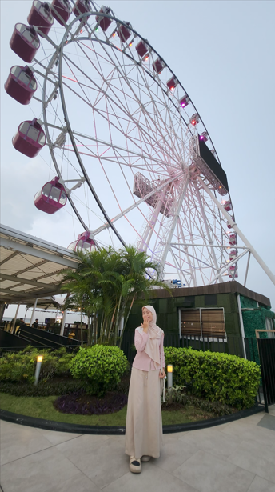

<!-- Profile Header -->
<h1 align="center"><!-- Profile Header -->
<h1 align="center">⋆. 𐙚˚࿔ Hi!, I'm Aisyah Nur Syifa 𝜗𝜚˚⋆</h1>
<h3 align="center">𓃠 Web & App Designer | 🐻‍❄️ྀིྀི UI/UX Explorer | 𓅇 Lifelong Learner</h3>

<!-- Profile Photo -->

  

---

### ೀ⋆｡🌷About Me 𐔌՞. .՞𐦯 ִ ࣪𖤐
🌱 call me Aisy (read like ice), a curious mind who loves learning new things in **IT and creative design**.  
💡 My passion lies in crafting **beautiful, functional experiences** through web & app design.  
🌍 Beyond tech, I enjoy **traveling** and finding inspiration from different cultures.  
✨ I believe design is not just about how it looks — but how it makes people feel.  

---

### 🐻‍❄️ྀིྀི Connect with Meִ ࣪𖤐

---

### ♬⋆.˚Tech Stack

  

---

### ♛ GitHub Stats & Analytics

  
  

  
  

  
  

---

###  ⋆.˚⭒⋆♛ Achievements & Trophies ♛⋆⭒˚.⋆

  

---

### ✩♬ ₊̊.🎧Contributions & Activity Graph⋆☾⋆⁺₊✧

  

---

###  Visitor Counter𓂃 ࣪˖ ִֶཐི༏ཋྀ󠀮

  

---

### Fun Prediction ᓚ₍⑅^..^₎♡
💫 People see me as a **creative soul with a tech-driven mind**.  
🎨 My journey blends **UI/UX design**, **education technology**, and a touch of wanderlust.  
🚀 I’m on my way to shaping ideas into digital realities that **inspire and connect people**.  

---

